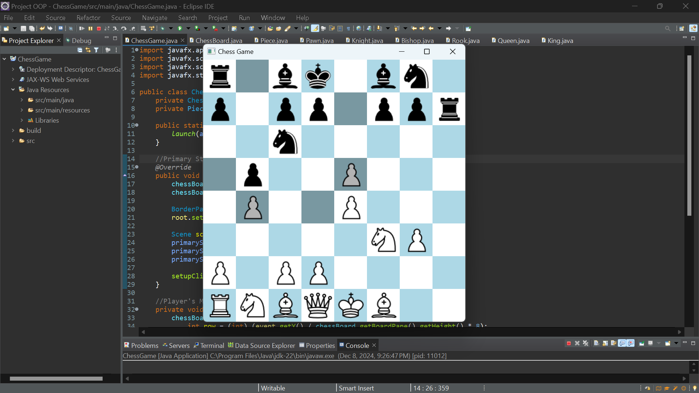
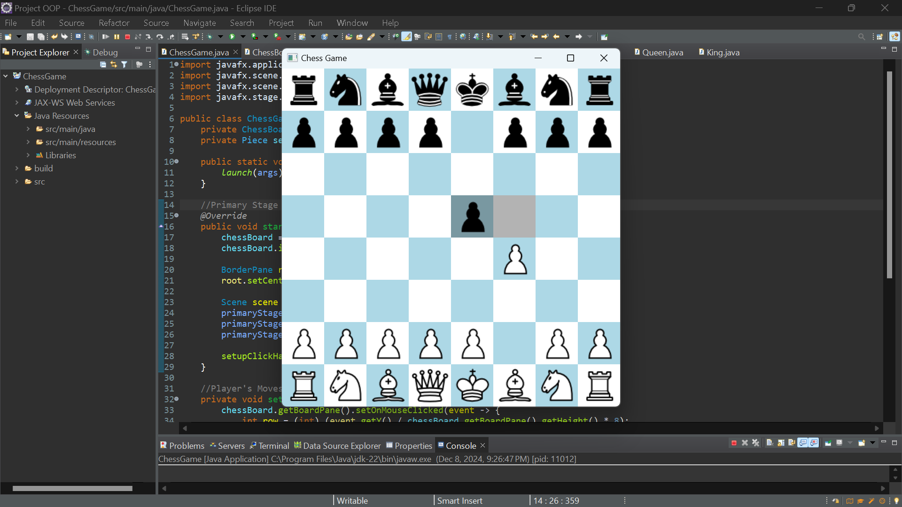
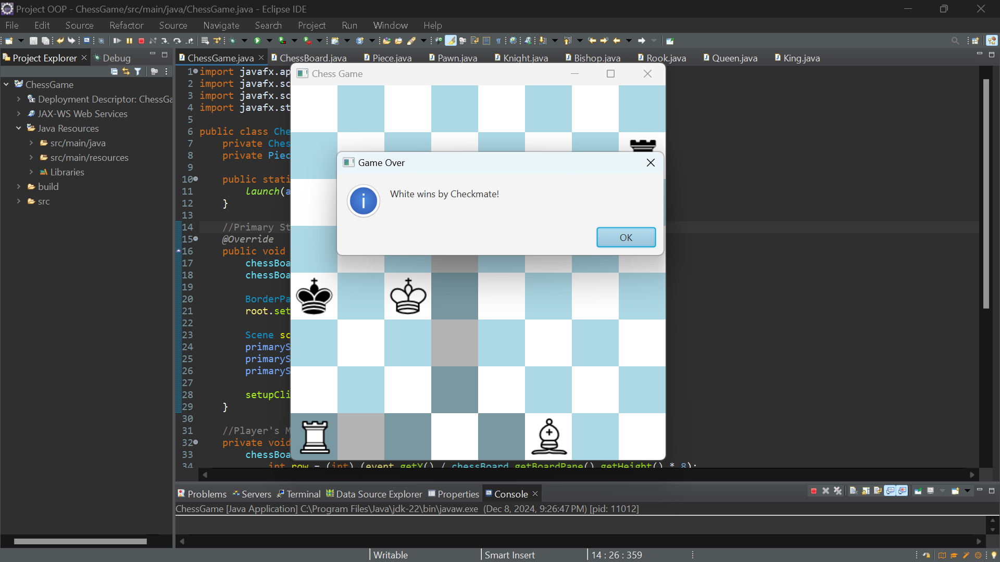
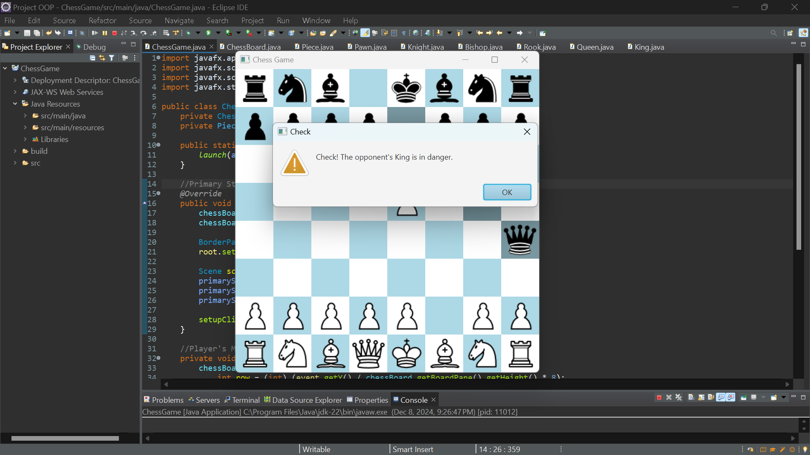

# ♟️ Chess Game

A fully functional two-player Chess Game built with **Java** and **JavaFX**. This desktop application brings the classic board game to life with a clean graphical interface, complete rule enforcement, and real-time move validation — all playable locally between two players.

---

## Features

- **Local Two-Player Mode:** Challenge a friend on the same machine.
- **Move Highlighting:** Legal moves are visually highlighted when a piece is selected.
- **Full Rule Enforcement:** All standard chess rules are implemented, including castling, en passant, and pawn promotion.
- **Check & Checkmate Alerts:** The game detects and notifies players when the king is in check or the game is over.
- **Pawn Promotion:** Pawns that reach the opposite end of the board are automatically promoted (defaults to Queen).
- **Stalemate Detection:** The game recognizes draw conditions and ends accordingly.

---

##  Technologies Used

| Technology | Purpose |
|------------|---------|
| **Java**   | Core game logic and rule engine |
| **JavaFX** | Graphical user interface and event handling |

---

## Getting Started

### Prerequisites
- Java JDK 11 or higher
- JavaFX SDK
- An IDE such as [Eclipse](https://www.eclipse.org/) or [IntelliJ IDEA](https://www.jetbrains.com/idea/)

### Running the Project
1. Clone or download this repository.
2. Open the project in your preferred Java IDE.
3. Make sure JavaFX is configured in your build path.
4. Build and run the `Main` class to launch the game.

---

## How to Play

1. **Launch the game** and the board will be set up automatically.
2. **Select a piece** by clicking on it — valid destination squares will be highlighted.
3. **Click a highlighted square** to move your piece.
4. The game will **alert you** if your king is in check.
5. The game **ends** when checkmate or stalemate is reached.

---

## Screenshots

| Whole Game Scene | Legal Moves |
|-------------|------------|
|  | 

| Checkmate | Check Alert |
|-----------|----------|
|  | |

---

## Contributing

Contributions are welcome! Whether it's fixing a bug, improving the UI, or adding new features like an AI opponent — feel free to fork the repo and open a pull request.

---

## License

This project is open source and available under the [MIT License](LICENSE).
